<br />
<div align="center">
  <a href="https://github.com/noahzmr/hue_outlook_sync">
    
  </a>

  <h3 align="center">Hue Outlook Calendar Sync</h3>

  <p align="center">
    A little inspiration for people who want to start a chat app with React!
    <br />
    <a href="https://github.com/noahzmr/hue_outlook_sync"><strong>Explore the docs »</strong></a>
    <br />
    <br />
    <a href="https://github.com/noahzmr/hue_outlook_sync/issues">Report Bug</a>
    ·
    <a href="https://github.com/noahzmr/hue_outlook_sync/discussions">Request Feature</a>
    ·
    <a href="https://learn.microsoft.com/en-us/graph/outlook-calendar-concept-overview">Outlook calendar API</a>
    ·
    <a href="https://developers.meethue.com/develop/get-started-2/">Hue develpoment</a>
  </p>
</div>

<details>
  <summary>Table of Contents</summary>
  <ol>
    <li>
      <a href="#introduction">Introduction</a>
      <ul>
        <li><a href="#built-with">Built With</a></li>
        <li><a href="#coming-soon">Coming Soon</a></li>
        <li><a href="#sonar-check">Sonar Check</a></li>
      </ul>
    </li>
    <li><a href="#architecture">Architecture</a></li>
    <li><a href="#keycloak">Keycloak</a>
      <ul>
        <li><a href="#what-is-keycloak?">What is keycloak?</a></li>
        <li><a href="#groups-and-roles">Groups and Roles</a></li>
      </ul>
    </li>
    <li><a href="#microsoft-graph">Microsoft Graph</a>
      <ul>
        <li><a href="#api-berechtigungen">API-Berechtigungen</a></li>
        <li><a href="#get-access">Get Access</a></li>
        <li><a href="#get-events">Get Events</a></li>
      </ul>
    </li>
    <li><a href="#hue">Hue</a></li>
    <li><a href="#syncer">Syncer</a></li>
    <li><a href="#setup">Setup</a>
      <ul>
        <li><a href="#requirement">Requirement</a></li>
        <li><a href="#setup#keycloak">Keycloak</a></li>
        <li><a href="#setup#the-syncer-application">The Syncer Application</a></li>
      </ul>
    </li>
    <li><a href="#contact">Contact</a></li>
    <li><a href="#die-medocino">The medocino</a></li>
    <li><a href="#support">Support</a></li>
    <li><a href="#license">License</a></li>
  </ol>
</details>

## Introduction

Welcome to my introduction to an Express JS app that uses React as a front-end and provides a sync service for Philips Hue lights, based on an Outlook calendar. This app uses the Hue API and the Microsoft Graph API to provide seamless integration between your calendar and your smart lights. For secure login, the app uses Keycloak and each route is protected by Keycloak. To ensure security, the sync service is not fully automated and requires manual interaction by the user. With this app, you can enjoy a truly integrated smart home solution and automate your daily routines to make your life easier and more enjoyable.

### Built With

[](https://learn.microsoft.com/de-de/graph/api/event-list-instances?view=graph-rest-1.0&tabs=http)
[](https://azure.microsoft.com/de-de/free/search/?ef_id=_k_CjwKCAjwo7iiBhAEEiwAsIxQEVBzBdO0LvuZAqz5srno7ikVR4Ej3HJ2H2oMVGYD0tm-naQ-L90jwRoC80QQAvD_BwE_k_&OCID=AIDcmmzzaokddl_SEM__k_CjwKCAjwo7iiBhAEEiwAsIxQEVBzBdO0LvuZAqz5srno7ikVR4Ej3HJ2H2oMVGYD0tm-naQ-L90jwRoC80QQAvD_BwE_k_&gad=1&gclid=CjwKCAjwo7iiBhAEEiwAsIxQEVBzBdO0LvuZAqz5srno7ikVR4Ej3HJ2H2oMVGYD0tm-naQ-L90jwRoC80QQAvD_BwE)
[](https://learn.microsoft.com/de-de/graph/overview)
[](https://www.philips-hue.com/de-de/products/promotions/smart-outdoor-lighting?origin=p70482392615&gclid=CjwKCAjwo7iiBhAEEiwAsIxQEVtt2KaqAZUeyl6FoJuCRlKM6VpPZQmdM3Zf16IEByfj1roHraKB4xoCTQMQAvD_BwE&gclsrc=aw.ds)
[](https://developers.meethue.com/login/?redirect_to=https%3A%2F%2Fdevelopers.meethue.com%2Fdevelop%2Fget-started-2%2Fcore-concepts%2F)
[](https://www.keycloak.org/)
[](https://axios-http.com/docs/intro)
[](https://expressjs.com/de/)
[](https://momentjs.com/)
[](https://eslint.org/)
[](https://fullcalendar.io/)
[](https://purgecss.com/)
[](https://sentry.io/)
[](https://react.dev/)
[](https://github.com/pahen/madge)

### Coming Soon

- [x] Setup Guide via UI
- [ ] Multiple Hue Bridges
- [ ] The whole thing as a Docker container
- [x] Instructions for setting up Keycloak
  - [x] Client JSON
  - [x] Instructions to register Keycloak in Azure
- [x] Instructions to register the app in Azure

### Sonar Check

[](https://sonarqube.autonubil.net/dashboard?id=hue_outlook_sync)
[](https://sonarqube.autonubil.net/dashboard?id=hue_outlook_sync)
[](https://sonarqube.autonubil.net/dashboard?id=hue_outlook_sync)
[](https://sonarqube.autonubil.net/dashboard?id=hue_outlook_sync)

## Architecture

The main idea is that thanks to ReactJS we have a simple and functional UI/UX. Over here the user can control everything. The ReactJS app is hosted by the ExpressJS server, where it also sends its requests. Every request that comes from ReactJS is sent with a keycloak token, so the user can only see what he is allowed to see. Keycloak is linked to Microsoft and acts as an OIDC. Through this connection we get the email address from the user. Thanks to the token and the email address we can now read the calendar events with the Microsoft Graph Api. Another important point is the connection with the Hue Bridge. This takes place in the same network, but there must be a valid keycloak token for each request.

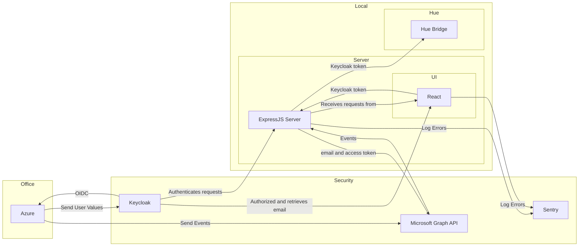

From for Components the React and Express App can be rendered with madge:

<details>
  <summary>madge Backend Image</summary>
  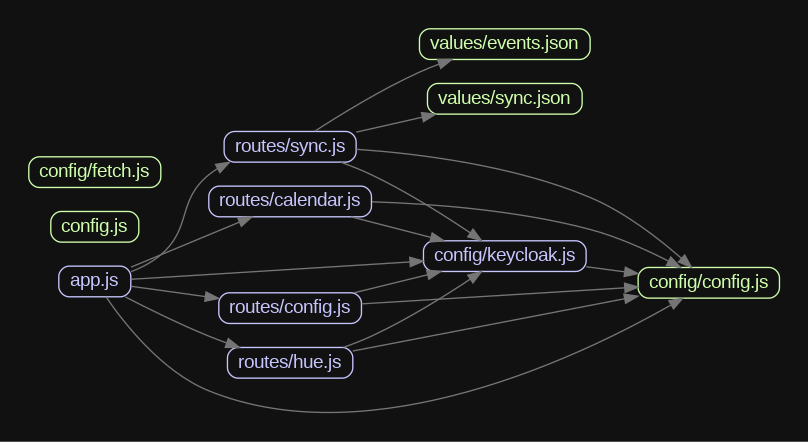
</details>

<details>
  <summary>madge UI Image</summary>
  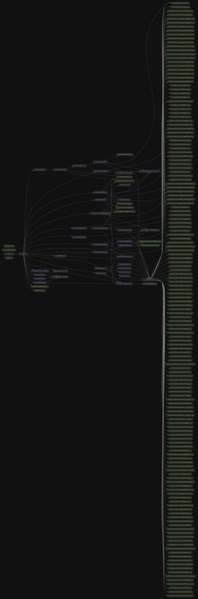
</details>
<br/>

To track down bugs when all bugs and their associated users are logged using Sentry, but what is Sentry exactly?
Sentry.io is a web-based platform for application performance monitoring (APM) and error tracking of software applications. The platform enables software application developers and operators to detect and fix problems and errors in real-time to improve the performance and reliability of their applications.

Sentry.io offers a variety of features, such as the ability to capture and aggregate errors and exceptions across multiple programming languages and frameworks to provide a comprehensive picture of application health. Users can also create and track custom metrics to monitor application performance and operation.

In addition to these features, Sentry.io also offers integrations with other tools and platforms, such as GitHub, Jira, and Slack, to help developers and operators collaborate and troubleshoot.

Overall, Sentry.io is a powerful platform for software application APM and error tracking that helps developers and operators resolve issues quickly and effectively to improve user experience and application reliability

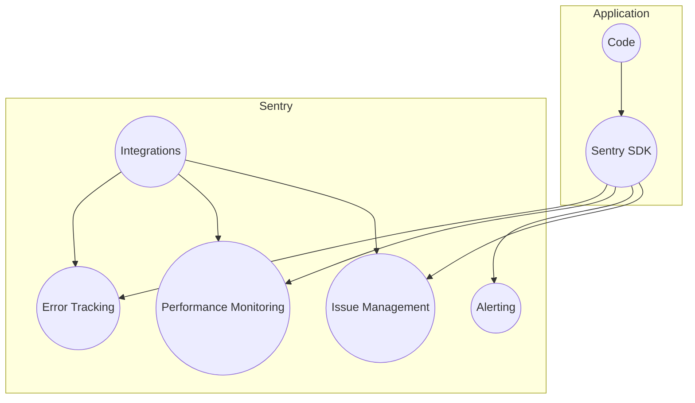

## Keycloak

### What is keycloak?

First of all, what is keycloak?

Keycloak is an open-source identity and access management solution that provides Single Sign-On (SSO) capabilities for web applications and services. It uses open protocols like OpenID Connect, OAuth 2.0, and SAML 2.0 to authenticate and authorize users.

Here's a high-level overview of how Keycloak works:

1. User logs in to an application: When a user tries to log in to an application, they are redirected to the Keycloak authentication server.
2. User authentication: The Keycloak server verifies the user's identity by checking their username and password against the configured authentication provider. This can be a local database, LDAP server, or social login provider like Google or Facebook.
3. Token issuance: Once the user is authenticated, Keycloak issues a token that contains the user's identity and other relevant information like their roles and permissions.
4. Token validation: The application can then use the token to verify the user's identity and authorize them to access protected resources. The token is signed and encrypted to prevent tampering.
5. Logout: When the user logs out of the application, Keycloak revokes the token and logs the user out of all the applications that use Keycloak for authentication.

Keycloak can also act as a central authentication and authorization service for multiple applications, allowing users to access all their resources with a single set of credentials. It provides a user-friendly interface for managing users, roles, and permissions, and can be integrated with popular development frameworks like Spring and Angular.

Simpler said you know how when you go to some websites or apps, you have to type in a username and password to get in? Keycloak is like a helper that makes that process easier and safer.

Instead of having to remember lots of different usernames and passwords for different websites and apps, Keycloak lets you use just one username and password for lots of different places. It's like having a magic key that unlocks lots of doors!

And Keycloak also helps keep your username and password safe. It makes sure that nobody else can steal them or use them without your permission. That way, you can use the internet and your apps without worrying about bad people getting your information.

So Keycloak is like a helpful friend that keeps your information safe and makes things easier for you.

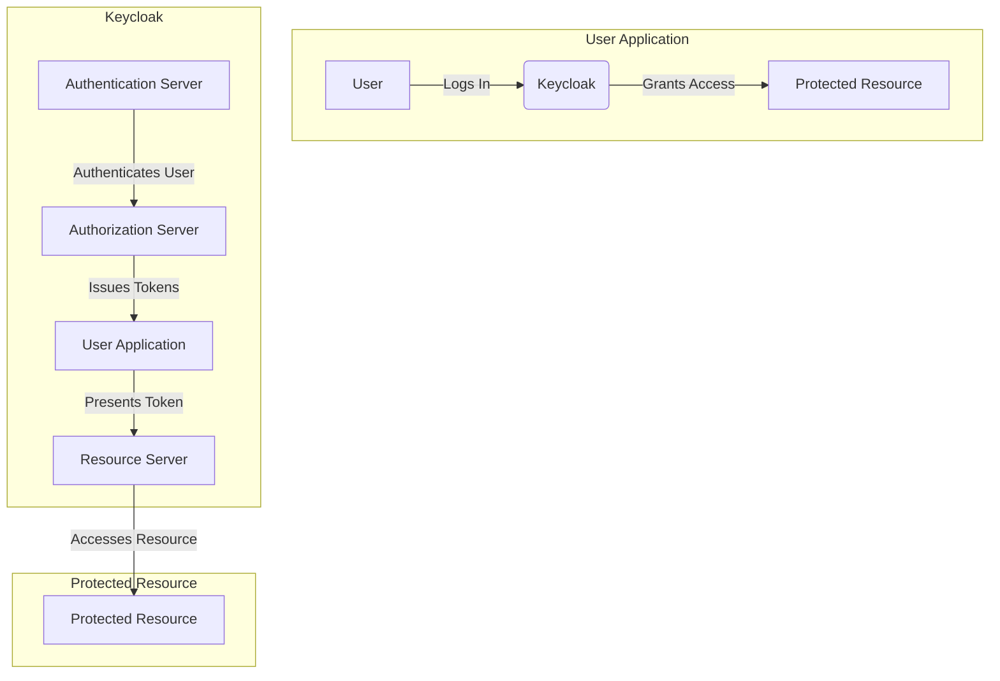

Keycloak has a feature called Social provider, this allows users to authenticate with their social media accounts, such as Facebook, Google, or Twitter, instead of creating a new username and password for each application they use. This provides a convenient and streamlined way for users to access multiple applications while maintaining their existing social media account information.

To use a social provider with Keycloak, you first need to configure the provider in the Keycloak Administration Console. This involves creating a new identity provider, providing the necessary configuration details, and optionally specifying the required scopes, roles, and mappers.

Once the social provider is configured, users can log in to the application using their social media account credentials. To do this, they select the social provider button on the application's login page, which redirects them to the corresponding social media login page. After the user successfully logs in to their social media account, the social media provider generates an access token and sends it back to Keycloak. Keycloak then verifies the access token, creates a new Keycloak user, and issues an access token and refresh token for the user.

After the user has successfully authenticated with the social provider, they can use the application just like any other user. The application can also use the Keycloak APIs to access the user's social media account information, such as their profile picture, email address, or friends list.

Overall, social provider is a convenient and secure way for users to authenticate with multiple applications using their existing social media accounts, while also allowing applications to access their social media information through Keycloak APIs.

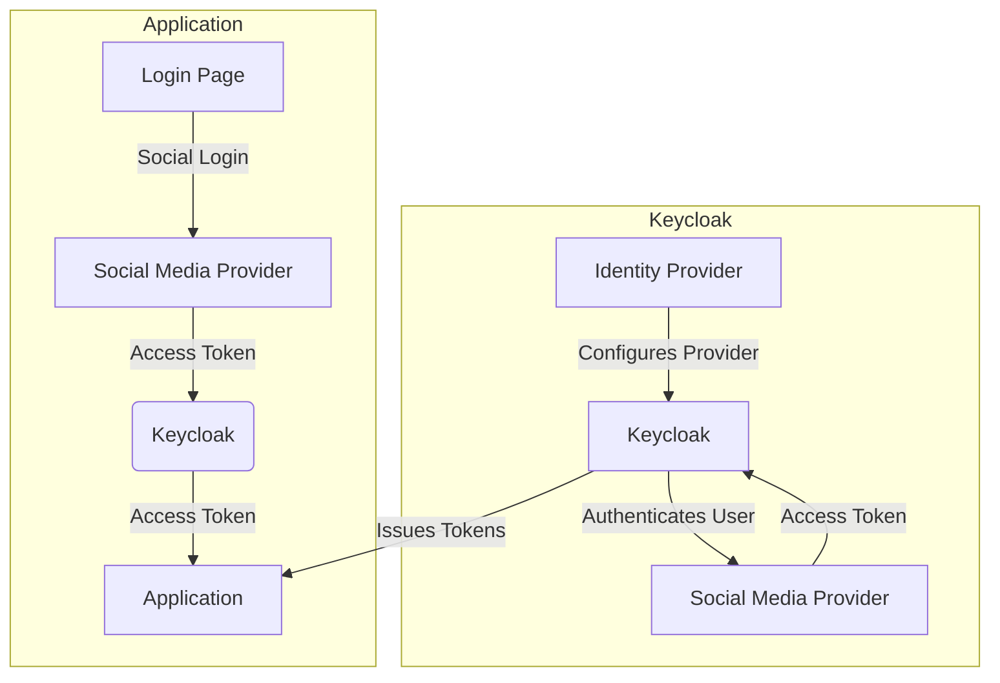

### Groups and Roles

The app has two keycloak groups, each assigned a role, with the role name corresponding to the group name. This is done to ensure that not everyone can access all resources. Routes in the backend are assigned to these roles so that only people who are part of the group/role can access the resource. To use the app, one must be a member of the `hue_outlook_sync` group. If one wants to make changes to the connections, such as the Azure, Keycloak, or Hue endpoint, one must be a member of the `hue_outlook_sync_admin` group.

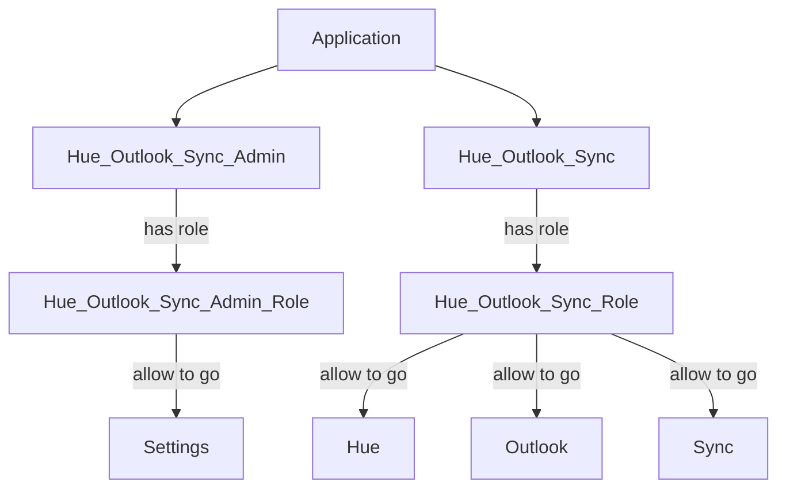

Of course, the routes in the React app are also protected. This is also done via Keycloak and the realm roll with the following function.

```jsx
import React from "react";
import { Navigate } from "react-router-dom";
import { KeycloakContext } from "./keycloak";
import { useContext } from "react";
import PropTypes from "prop-types";

const checkRole = (roles, role) => {
  console.warn(
    "ROLES: ",
    roles,
    role,
    roles.includes(role[0]) || roles.includes(role[1])
  );
  return roles.includes(role[0]) || roles.includes(role[1]);
};

const PrivateRoute = ({ component: Component, roles }) => {
  PrivateRoute.propTypes = {
    component: PropTypes.any.isRequired,
    roles: PropTypes.any.isRequired,
  };

  const kcContext = useContext(KeycloakContext);
  const kc = kcContext.keycloak;
  const realmAccess = kc.realmAccess.roles;
  if (kc.authenticated && checkRole(realmAccess, roles)) {
    return Component;
  } else {
    return <Navigate to={{ pathname: "/403" }} />;
  }
};

export default PrivateRoute;
```

The function is called randomly in the router:

```jsx
<Route
  path="/config"
  element={
    <PrivateRoute
      exact
      path="/config"
      component={<Config />}
      roles={["hue_outlook_sync_admin"]}
    />
  }
/>
```

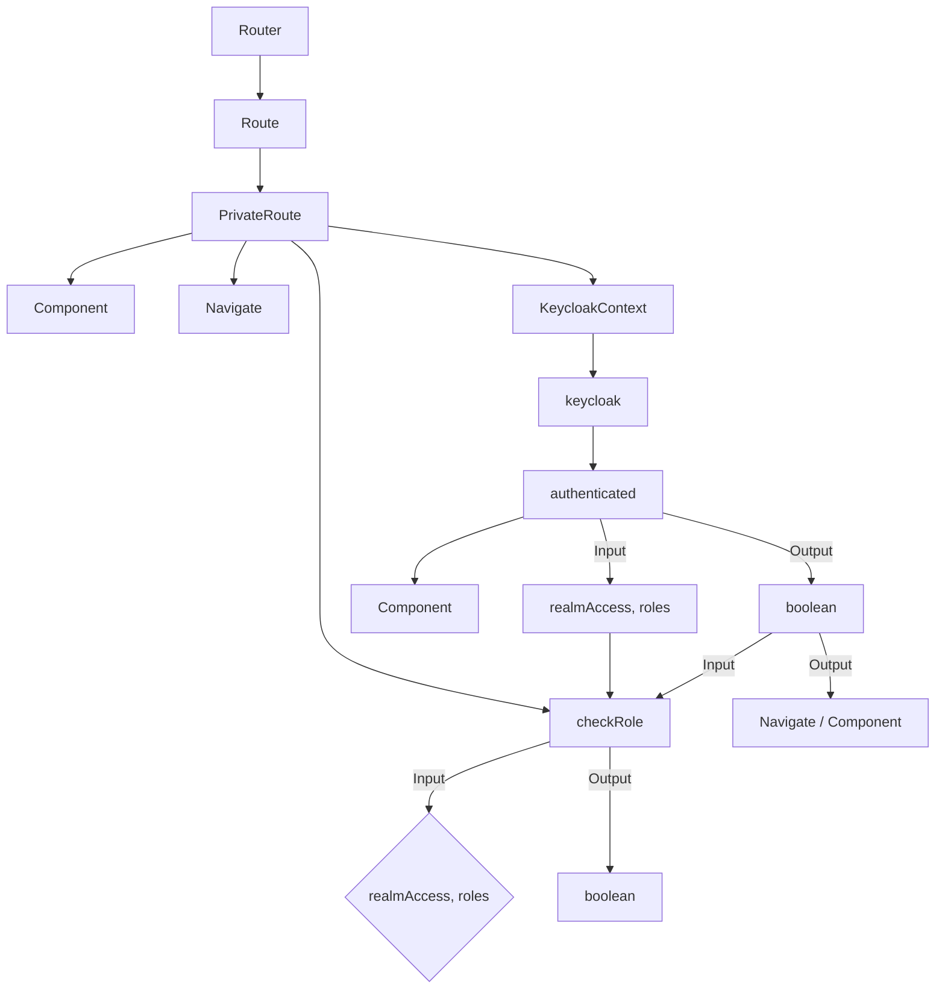

## Microsoft Graph

Microsoft Graph is a RESTful API that enables developers to access Microsoft 365 data and functionality. The API is an interface for developers to access information and actions from users, groups, calendars, contacts, emails, documents, and other services of Microsoft 365.

Microsoft Graph provides a standardized way to access this data and functionality from multiple platforms and devices, including web apps, native desktop and mobile apps, and IoT devices.

The API is built on OAuth 2.0 authentication, which allows developers to establish an authorized connection to Microsoft Graph. Authorization is achieved by the user agreeing to an application accessing the data and services they share.

The API supports multiple data types such as JSON, XML and OData and provides a variety of endpoints for different services in Microsoft 365, including Office, OneDrive, SharePoint, Outlook, Teams and more.

By using Microsoft Graph, developers can create applications that can access and leverage Microsoft 365 data and functionality to increase user productivity by providing them with personalized and relevant information and actions.

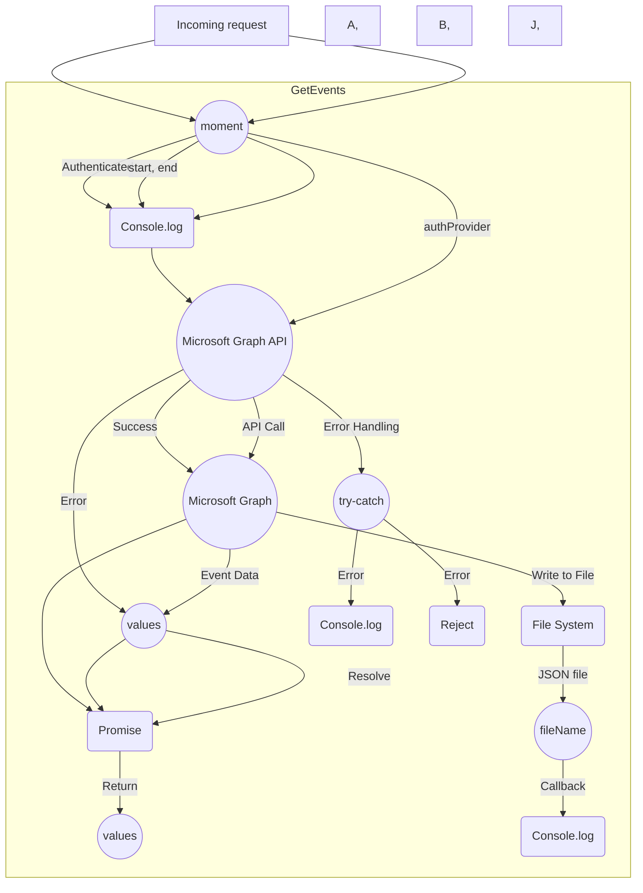

### API-Berechtigungen

API permissions are used to specify which data and services of a developer application are accessible in Microsoft Graph. There are two types of permissions: Delegated permissions and application permissions.

Delegated permissions are permissions granted to the developer application to access its data and services in Microsoft Graph on behalf of the user. These permissions are granted during the user's authorization process. An example of a delegated permission is User.Read, which allows the application to read the user's profile information.

Application permissions are permissions granted to the developer application to access data and services in Microsoft Graph independent of user access. These permissions are granted to the application during registration in Azure AD. An example of an application permission is Directory.Read.All, which allows the application to retrieve information from the Azure AD directory.

The use of permissions in Microsoft Graph is an important security consideration, ensuring that applications can only access the data and services they have been authorized to access. Developers should only ever request the minimum permissions required for their application to ensure the security of user data.

Overall, API permissions in Microsoft Graph provide developers with the ability to securely and effectively manage access to data and services in Office 365 to ensure that only authorized applications can access the data and services.

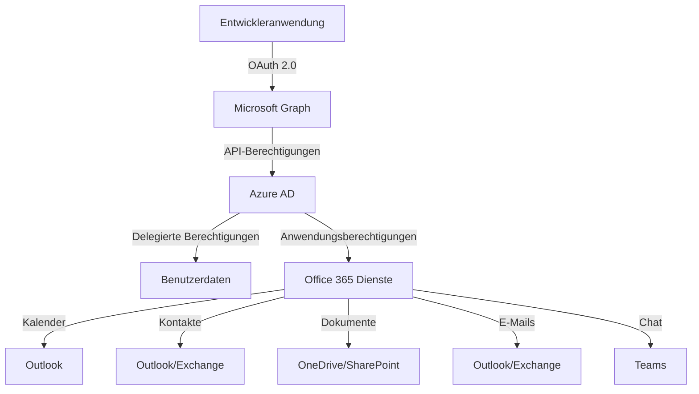

### Get Access

The route uses the Express Router module and is configured to a GET request path with the "email" parameter. In addition, the keycloak protection function is called to ensure that only authenticated users can access the route.

After the request is successfully authenticated, the callback function is executed. In the callback function, the value of the "email" parameter is first logged in the console.

Then, using Axios, a POST request is sent to the Microsoft Graph API endpoint "https://login.microsoftonline.com/{TENANT_ID}/oauth2/v2.0/token" to obtain an Access Token to authenticate the API call. This uses the Client ID, Client Secret, and Tenant ID values stored in the environment variable. The access permission "https://graph.microsoft.com/.default" is specified as the value for the "scope" parameter.

If the request is successful, the received Access Token is extracted from the response and forwarded to the "GetEvents" function explained in a previous example. If the function is executed successfully, the result is returned to the client as a response. Otherwise, an error message is sent to the client and the error message is logged in the console.

If the POST request to the Microsoft Graph API endpoint fails, an error message is returned to the client and the error message is logged in the console.

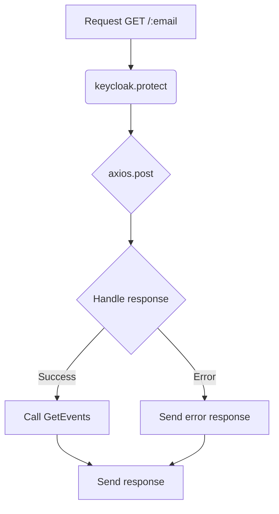

### Get Events

The `GetEvents` function is a function that allows to retrieve the next 10 events in the calendar of a given user. The function expects two parameters: `accessToken` and `email`. `accessToken` is a JWT token requested by the developer application to access the Microsoft Graph API. `email` is the email address of the user whose calendar events are to be retrieved.

The function uses the `moment.js` library to define the start and end dates for querying the calendar. The start date is the current date and time in the "Europe/Berlin" time zone. The end date is 7 days later than the start date in the same time zone.

Then, the Microsoft Graph client library is used to connect to the Microsoft Graph API. The `init()` method is called and an `authProvider` function is defined to pass the JWT token.

Then an empty list values is created to store the retrieved events. A new Promise object is created to allow asynchronous execution of the query and processing of the results.

In the try block, Microsoft Graph's API is called to retrieve the next 10 events in the specified user's calendar. The `api()` method is used to define the URL of the API query, which contains the user's email parameter and the start and end dates of the query. The `header()` method is used to set the preferred timezone name for the response. The `top()` method is used to limit the maximum number of results to 10, and the `orderby()` method is used to sort the results by the event start date in descending order.

The results are iterated through to store each event in the values array. Each event is stored as an object containing the key properties of the event, such as the ID, title, start and end dates, whether it is an all-day event, whether a reminder is enabled, whether the event has been canceled, and other important information.

The values array is then passed to the resolve argument of the Promise object to indicate successful completion of the query. The fs.writeFile() method is also called to save the results to a file.

If an error occurs, the catch clause is executed and the error is output. The reject argument of the Promise object is also called with the error to indicate the incorrect completion of the query.

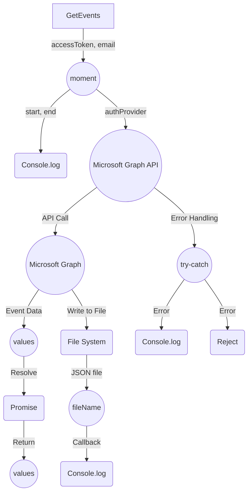

## Hue

The Philips Hue API allows developers to access and control Hue lighting systems. Here is a basic explanation of how the Hue API works:

Authentication: to access the Hue API, developers must create a developer account and authenticate. To do this, the system generates an access key that the developer must include in their application.

Searching for lamps: Once the access key is created, the application can search for available Hue lamps through the API. Each lamp is given a unique ID that can be used for control.

Controlling lamps: Developers can use the API to control Hue lamps. To do this, they can set various properties such as color, brightness, and temperature. The API can also be used to perform certain actions, such as blinking the lamps or running predefined scenes.

Integration with other applications: The Hue API can also be integrated with other applications to enable lamp control. For example, developers can integrate the API with smart home systems to automatically control lighting based on specific events or conditions.

In summary, the Hue API allows developers to access and control Hue lamps, enabling seamless integration with other applications and systems.

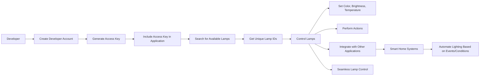

All Hue Requests are configured with a specific Axios function.

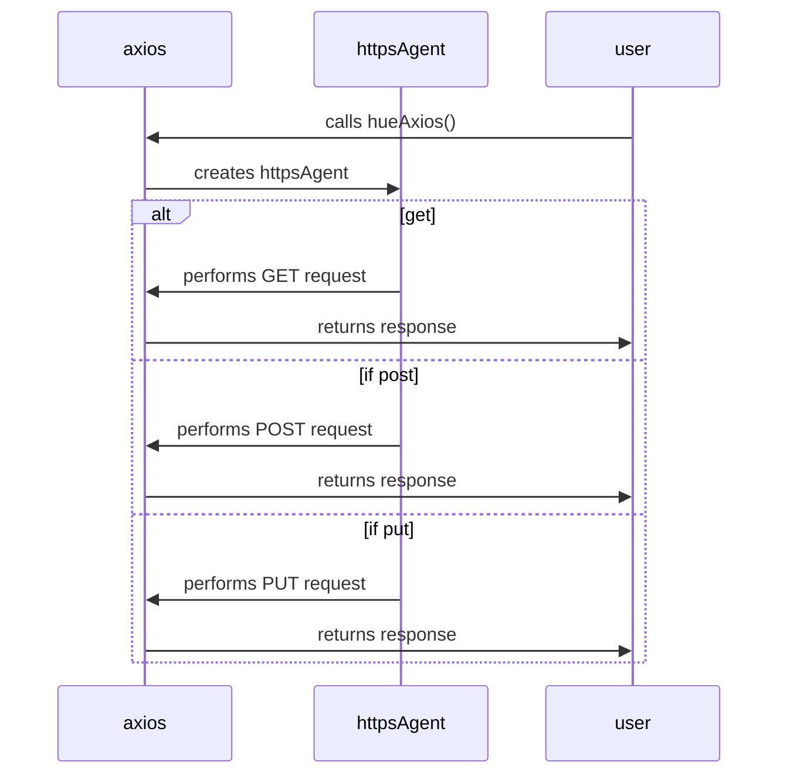

## Syncer

The Sync Route allows to synchronize with a calendar system and a lighting system. The functions are as follows:

`ActivateSceneGroup`: this function activates a scene in a group of lights. It takes the name of the scene and the name of the group as arguments and uses the "axios" library to send a PUT request to the lighting system. The httpsAgent is created to use a self-signed SSL certificate for communication between the server application and the lighting system. If the request is successful, the response is logged, otherwise the error message is logged.

`setAlarm`: This function is called to set an alarm event that will be activated when a specific date and time is reached. The function takes the date and time as arguments and then calculates the time difference between the current time and the event time. If the time difference is negative, the function returns an error, otherwise it calls the ActivateSceneGroup function to activate the scene in the group of lights.

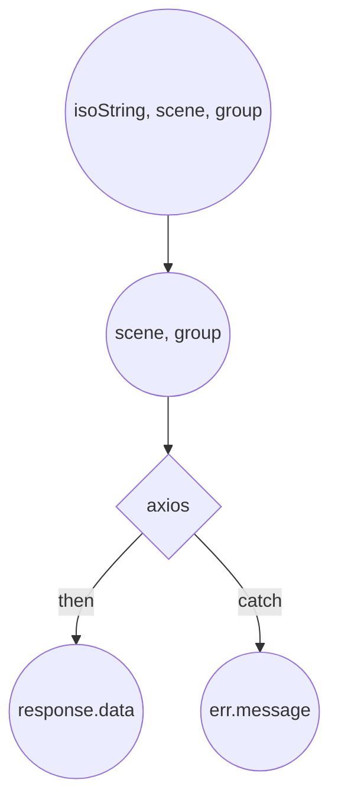

`Sync`: This function reads from a JSON file named "sync.json" and contains synchronization rules for calendar and lighting systems. The function iterates through each element in the array syncArray and calls setAlarm for each matching event found on the calendar. If there is no matching event, "No Syncs" is returned.

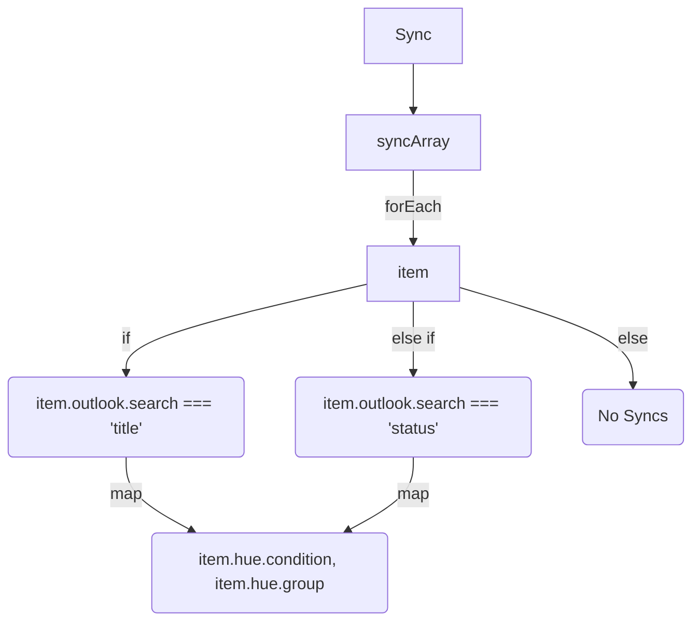

## Setup

For the app to communicate with Keycloak without problems, a valid SSL certifkat is required the url must also match the certificate, otherwise you get a "Name Mismatch Error".

You can just pullen the Docker image, or just copy the project and use the `docker-compose`. Whether you want to set it up with Docker or local you need to set the following values:

<ul>
  <li><input type="checkbox" id="HTTPS" name="HTTPS"/> <label for="HTTPS">HTTPS</label>
    <ul>
      <li><input type="checkbox" id="cert" name="cert"/> <label for="cert">cert.cer file</label></li>
      <li><input type="checkbox" id="key" name="key"/> <label for="key">key.key file</label></li>
    </ul>
  </li>
  <li><input type="checkbox" id="Sentry" name="Sentry"/> <label for="Sentry">Sentry DSN in the React app</label></li>
</ul>

The Sentry settings can be found in the following path `hue_outlook_ui/src/index.jsx` and the field where you have to insert something looks like this:

```jsx
Sentry.init({
  dsn: "<YOUR SENTRY DSN>",
  integrations: [new BrowserTracing()],
  // environment:
  //   location.hostname === 'localhost' ||
  //   location.hostname === '127.0.0.1' ||
  //   location.hostname === 'demo.noerkelit.online'
  //     ? 'Development'
  //     : 'Production',
  // Set tracesSampleRate to 1.0 to capture 100%
  // of transactions for performance monitoring.
  // We recommend adjusting this value in production
  tracesSampleRate: 1.0,
});
```

If you are accessing the page for the first time, and have not pre-edited `config.json` you will need to go to https://[your app ulr]:[the port if nessassary]/config/setup. The page is only accessible if there is no Keycloak Config.

### Requirement

- [](https://www.keycloak.org/) Server with Admin right
- [](https://azure.microsoft.com/de-de/free/search/?ef_id=_k_CjwKCAjwo7iiBhAEEiwAsIxQEVBzBdO0LvuZAqz5srno7ikVR4Ej3HJ2H2oMVGYD0tm-naQ-L90jwRoC80QQAvD_BwE_k_&OCID=AIDcmmzzaokddl_SEM__k_CjwKCAjwo7iiBhAEEiwAsIxQEVBzBdO0LvuZAqz5srno7ikVR4Ej3HJ2H2oMVGYD0tm-naQ-L90jwRoC80QQAvD_BwE_k_&gad=1&gclid=CjwKCAjwo7iiBhAEEiwAsIxQEVBzBdO0LvuZAqz5srno7ikVR4Ej3HJ2H2oMVGYD0tm-naQ-L90jwRoC80QQAvD_BwE) aggression with admin rights
- [](https://www.docker.com/)
- [](https://github.com/nvm-sh/nvm)

### Keycloak

1. Login to your Keycloak Server, choose the Realm, where you want to add the Application.
2. Create a Client
3. Set the

- Root URL
- Home URL
- Valid redirect URIs
- Valid post logout redirect URIs
- Web origins

to https://[your app ulr]:[the port if nessassary]
The rest can remain default.
Example JSON:

```json
{
  "clientId": "hue_outlook_sync",
  "name": "Hue Outlook Sync",
  "description": "",
  "rootUrl": "https://demo.noerkelit.online:3000/",
  "adminUrl": "",
  "baseUrl": "https://demo.noerkelit.online:3001/",
  "surrogateAuthRequired": false,
  "enabled": true,
  "alwaysDisplayInConsole": false,
  "clientAuthenticatorType": "client-secret",
  "redirectUris": [
    "https://demo.noerkelit.online:3000/*",
    "https://demo.noerkelit.online:3001/*"
  ],
  "webOrigins": [
    "https://demo.noerkelit.online:3000/*",
    "https://demo.noerkelit.online:3001/*",
    "https://demo.noerkelit.online:3001"
  ],
  "notBefore": 0,
  "bearerOnly": false,
  "consentRequired": false,
  "standardFlowEnabled": true,
  "implicitFlowEnabled": false,
  "directAccessGrantsEnabled": false,
  "serviceAccountsEnabled": false,
  "publicClient": true,
  "frontchannelLogout": false,
  "protocol": "openid-connect",
  "attributes": {
    "client.secret.creation.time": "1682695079",
    "post.logout.redirect.uris": "https://demo.noerkelit.online:3000/*##https://demo.noerkelit.online:3001/*",
    "oauth2.device.authorization.grant.enabled": "false",
    "backchannel.logout.revoke.offline.tokens": "false",
    "use.refresh.tokens": "true",
    "tls-client-certificate-bound-access-tokens": "false",
    "oidc.ciba.grant.enabled": "false",
    "backchannel.logout.session.required": "true",
    "client_credentials.use_refresh_token": "false",
    "require.pushed.authorization.requests": "false",
    "acr.loa.map": "{}",
    "display.on.consent.screen": "false",
    "token.response.type.bearer.lower-case": "false"
  },
  "authenticationFlowBindingOverrides": {},
  "fullScopeAllowed": true,
  "nodeReRegistrationTimeout": -1,
  "defaultClientScopes": ["web-origins", "acr", "roles", "profile", "email"],
  "optionalClientScopes": [
    "address",
    "phone",
    "offline_access",
    "microprofile-jwt"
  ],
  "access": {
    "view": true,
    "configure": true,
    "manage": true
  }
}
```

Next, we need to set Microsoft as the Identify Provider, which we do:

1. click on "Identity Providers" and then on "Add provider". Select `Microsoft` from the list.
2. now you need to fill in some fields:

- `Name`: enter a name for the identity provider.
- `Client ID`: go to the Azure portal home page, select the directory and navigate to "App registrations". Click on the appropriate application and copy the "Application (client) ID".
- `Client Secret`: In Azure, under "Certificates & secrets", click "+ New client secret". Enter a description and click "Add". Then copy and paste the client secret into Keycloak.
- `Authorization URL`: enter the value "https://login.microsoftonline.com/{tenant}/oauth2/v2.0/authorize". Replace {tenant} with the name of your Azure directory.
- `Token URL`: enter the value "https://login.microsoftonline.com/{tenant}/oauth2/v2.0/token".
- `Logout URL`: enter the value "https://login.microsoftonline.com/{tenant}/oauth2/v2.0/logout".
- `Default Scopes`: Enter openid email profile.

To be able to log in with keycloak we have to register the app in Azure.

#### Keycloak

1. Log in to Microsoft Azure and navigate to the Azure portal.

2. Click "Azure Active Directory" in the left menu bar and select the directory where you want to register the Keycloak app.

3. Click "App registrations" and then click "+ New registration".

4. Enter a name for the application and select "Single tenant" or "Multitenant" depending on your requirements.

5. Enter a Redirect URI. This URL will be used to redirect users back to Keycloak after authentication. The default redirect URI for Keycloak is "https://{keycloak-url}:8080/auth/realms/{realm}/broker/{idp}/endpoint".

6. Click Register to register the application.

7. Navigate to the newly created application page by clicking on the application name.

8. Click "API Permissions" and then click "Add access to an API".

9. Select "Microsoft Graph" from the list and click "Add application permissions". Then enter the permissions that your application requires.

10. Click "Add access to an API", select "Microsoft Graph", and then select the `User.Read` and `openid` permissions.

11. Click "Save" to save the permissions.

12. Copy the "Application (client) ID" and the "Directory (tenant) ID" as you will need them to register Keycloak as an Identity Provider in Azure.

#### The Syncer Application

In order to register the Syncer Application in Azure, points 1-4 must be taken from the Keycloak Azure registration.

In the `API Permission` section we give the app the permission `Calendars.Read` so the app is only allowed to read calendar entries. All other interactions are handled with the http code: 403 Forbidden.

In the `Overview` we add the URL of our app to the `Redirect URIs`, as example `https://demo.noerkelit.online:3001`.

## Contact

<div style='display: flex; flex-direction: row; justify-content: space-around;'>

[](https://www.xing.com/profile/NoahDanyael_Zeumer/)

[](https://www.linkedin.com/in/noah-zeumer-34b5081a5/?originalSubdomain=de)

[](mailto:noah@noerkelit.online)

<a href='https://taag.co/GxxtAjXSpr1679622602xuDhbkVpDX' target="_blank"></a>

</div>

## The medocino

<div style='display: flex; flex-direction: row; justify-content: space-around;'>

<a href='https://medocino.net/' target="_blank"></a>

<a href='https://medocino.net/' style="width: 200px;" target="_blank"></a>

</div>

medocino Hamburg GmbH is an experienced system house and IT service provider specializing in the development and support of IT infrastructures. With a team of dedicated IT experts, we offer comprehensive services and customized solutions for well-known corporations, medium-sized companies and start-ups.

Our customers appreciate our expertise, experience and passion for IT. We see IT as a solid craft and offer individual solutions tailored to the specific requirements of each company. In doing so, we rely on reliable technologies, innovative approaches and proven methods.

As the medocino group, we offer holistic support and stand by our customers as a reliable partner. Our team consists of highly qualified employees who are not only technically skilled but also highly customer-oriented.

However, we are not only active as a service provider, but also as a training company for prospective IT specialists in system integration. I speak from experience, as I am currently doing an apprenticeship at medocino and am part of the team. With us, you have the opportunity to complete an apprenticeship in the IT field and also become part of our team. I can say from my own experience that we attach great importance to a sound education and offer you the chance to gain practical experience and to develop professionally.

Our goal is to optimize our customers' IT infrastructure, improve processes and create real added value. We offer comprehensive services in the areas of storage technology, infrastructure automation, high availability solutions and data center services.

Rely on medocino Group to help you overcome your IT challenges and successfully move your business forward. Contact us today to learn how we can help you.

Below, I present a graphical overview of the wide range of services offered by medocino Hamburg GmbH.

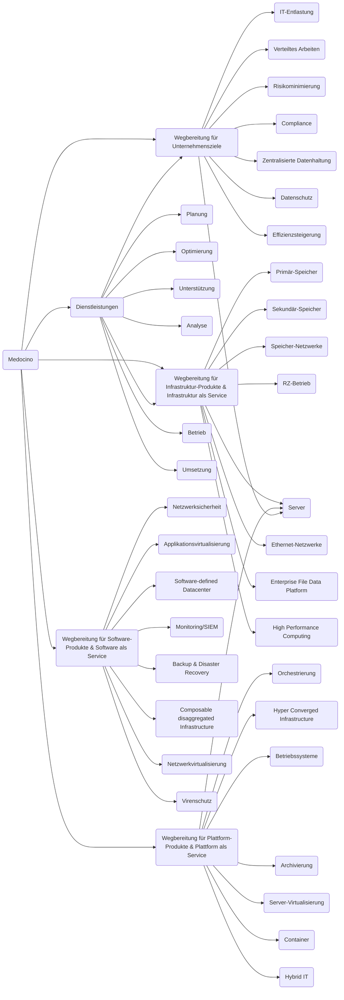

I am incredibly grateful to have the opportunity to complete my training at Medocino. Here, I not only get the chance to familiarize myself with the classic tasks of system integration, but also to gain insights into the exciting areas of software development and IT security.

What makes working here particularly rewarding is the variety of services that are available to me. For example, I can access tools such as Sentry, GitLab and SonarQube to optimize my work and develop high-quality solutions. These resources allow me to develop my skills and continuously improve in my area of expertise.

I am excited to see what exciting projects and challenges are still waiting for me and look forward to being part of the Medocino team.

## Support

If you want to support my work, you are welcome to buy me a cup of coffee. Just visit my [](https://www.buymeacoffee.com/noahdnylzmr)
and enter an amount of your choice. I am grateful for any support.
Thank you in advance!

## License

This project is licensed under the [BSD 2-Clause License](https://github.com/noahzmr/arduino-alarmanlage/blob/main/LICENSE.md). Please note the terms and conditions of this license.
